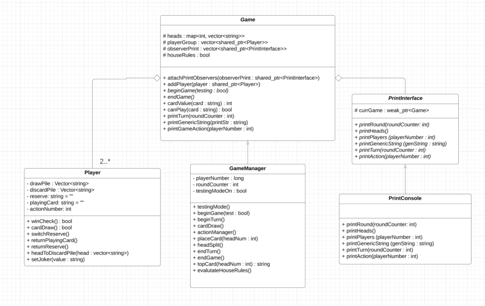
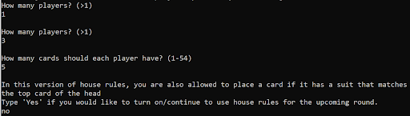
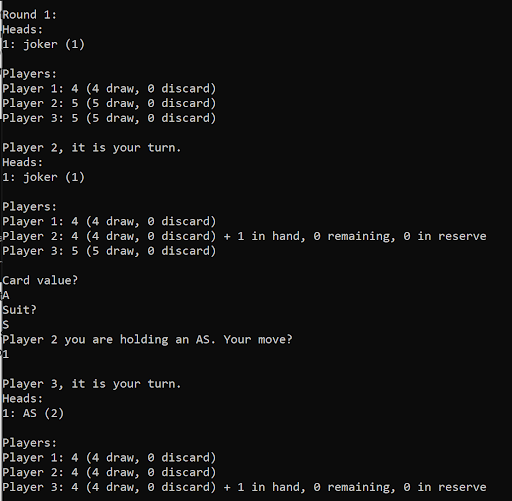
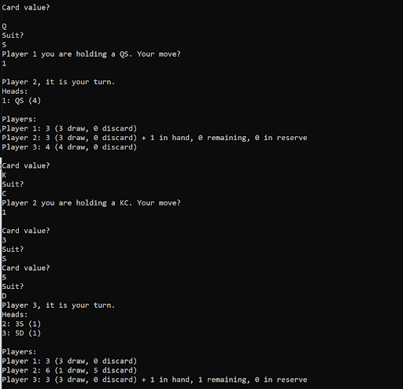
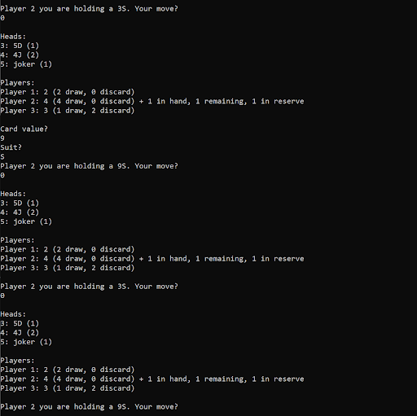
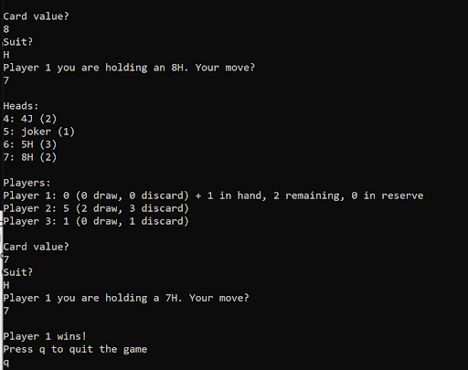

# Hydra Card Game

# Table of Contents

- [Description](#description)
- [UML Diagram](#uml-diagram)
- [How to Play](#how-to-play)
- [Additional Features](#additional-features)
- [Demo](#demo)

## Description
Hydra is a card game I developed to demonstrate my knowlegde of coding standards and object oriented programming in a fun way.
I programming this C++ application with design patterns, modern C++ features like smart pointers 
and object oriented design principles (encapsulation, inheritance, abstraction, and polymorphism). 
Due to how uncommon the game is, I've included how to play the game below and a demonstration with pictures.

## UML Diagram

## How to Play

### Set up
To set up, one needs as many standard 54-card decks as there are players, which are shuffled together and then distributed equally to each player, face down in a pile. 
This pile is each player’s draw pile, and each player additionally has a discard pile, which starts empty, and a reserve that can only hold one card during the player's turn. 
To start the game, the first player places a single card from the top of their draw pile face up in the center of the table, creating the first “head”. 
From there, play proceeds clockwise. 

### Rules
The objective of the game is to be the first player to have no cards in your discard pile, draw pile or reserve. 
For each turn one must draw and play as many cards as there are heads in the middle of the table, unless an action ends the turn early. 

To play a card, the player draws it from the top of the player’s draw pile, and performs an action with it. 
If the player’s draw pile is empty, the player must first shuffle their discard pile to form a new draw pile, then draw from that. 
If the player’s draw and discard piles are both empty, but they have a reserve, then the turn ends immediately and the reserve is placed back into the discard pile. 

The following are all possible actions once a card is drawn:
1. If the value of the card is less than the value of the top card of any head, the card may be placed, face-up on that head.
2. If the value of the card is equal to the face value of the top card of any head, the card may be placed, face up, on that head, but this ends the player’s turn immediately, and they draw no further cards.
3. If the value of the card is greater than the value of the top card on all the heads, it can not be played. This means you pick up the oldest head card pile (along with your card in hand) and add it to your discard pile. 
Then you take the top two cards of your draw pile and set them face up in the middle as two new heads (essentially "splitting the head", hence the name Hydra). Finally, this immediately ends your turn.
4. If the player has no card in reserve, and there is more than one head, they may place this card into reserve. To do so, the player simply places the card, face down, in front of them. Note that this counts as an action.
5. If the player has a reserve, then the player may swap the played card for the reserve card. Note that swapping does not count as an action and you may do this as many times as you would like during a turn.

At the end of every turn, if a card was put in reserve, then it is put in the discard pile.
Therefore, it is not possible to have a card in hand or in reserve when it is not the player's turn.

In terms of card values, 2 is the lowest value and K is the highest value (suit does not matter).
Aces may be placed on top of any card and any card may be placed on top of an ace.
Finally, if the card played is a joker then the player chooses its value, as long as it can be played on the chosen head. 

### Miscellaneous

You may not split a head if it is possible for you to play, this includes choosing a joker value that can't be played. 
However, you can swap with your reserve so that the card you are holding in hand forces you to split a head.
If the first card when creating a head happens to be a joker, then it is taken to have the value 2.
It is not possible to win on a turn you have put a card in reserve because you can only swap after that so there will always be a card in reserve that can't be played in the turn.
Finally, one house rule I added was that if the suit of your card matches the suit of the head's top card you can play it regardless of the value. 

### Interface

Before every action you will be given updated information about the heads including the top card and the number of cards in each pile. 
Then you will be updated on player information including the number of cards left, number in draw pile, number in discard, if a card is in hand, number of cards still to be drawn and if a card is in reserve. 
Each head will also include an identification number, so that you type that number to place your card there. You can type 0 and it will place your card in reserve if done for the first time and swap with reserve otherwise. 
Finally, in testing you can provide: A, 2-10, J, Q, K, joker when prompted for the value and the following for suits: D, S, C, H.

## Additional Features

### House Rule

I added a house rule that allows you to place a card if the suit of your card matches the suit of the head's top card.
In order to make the rule optional, I added a feature to ask the players if they would like to toggle the house rules at the beginning of each turn.
In this way, it is possible for the players to change their mind and dynamically change the rules without having to restart. 

### Testing Mode

You run the game with command line `-testing` to enter testing mode. With this feature you can choose the number of cards each player has and 
every time a card is drawn, it will prompt the user to set the card's suit and value, reasking if given invalid responses. 
This includes the first card played and when two cards are drawn to create new head piles. 
I've included this feature to test all scenarios and ensure the game's full functionality. 

## Demo 

Note that the demo was done in testing mode and therefore the user will decide the card suit and value, which would not occur in a normal game.  

When run the program asks the user for the number of players, number of cards per deck and if they would like the house rules on, which we've decided not to have.

   

We have set the first card to be a joker, which is given a default value of 2 and then given ourselves an AS which can be placed normally since aces can be played on anything.
Following this the player's turn is ended because there is one head and so the player only gets to draw and play one card.

   

In the next image, we have first given ourselves a QS which is again less than the top card on the head and therefore can be played. 
The next card we gave outselves is a KC, which is greater than a Q. Since it is not possible to play it splits the head and ends the turn, setting the top card of the next two heads as 5D and 3S. 

   

This image demonstrates switching capabilities. First we draw a 3S, which we put in reserve and draw the next card which is a 9S. Now we have a card in reserve and one in hand so we can switch back and forth without it counting as a new card drawn. 

   

In the final image player one plays his final card, such that his discard pile, draw pile and reserve are empty, making them the winner. 

